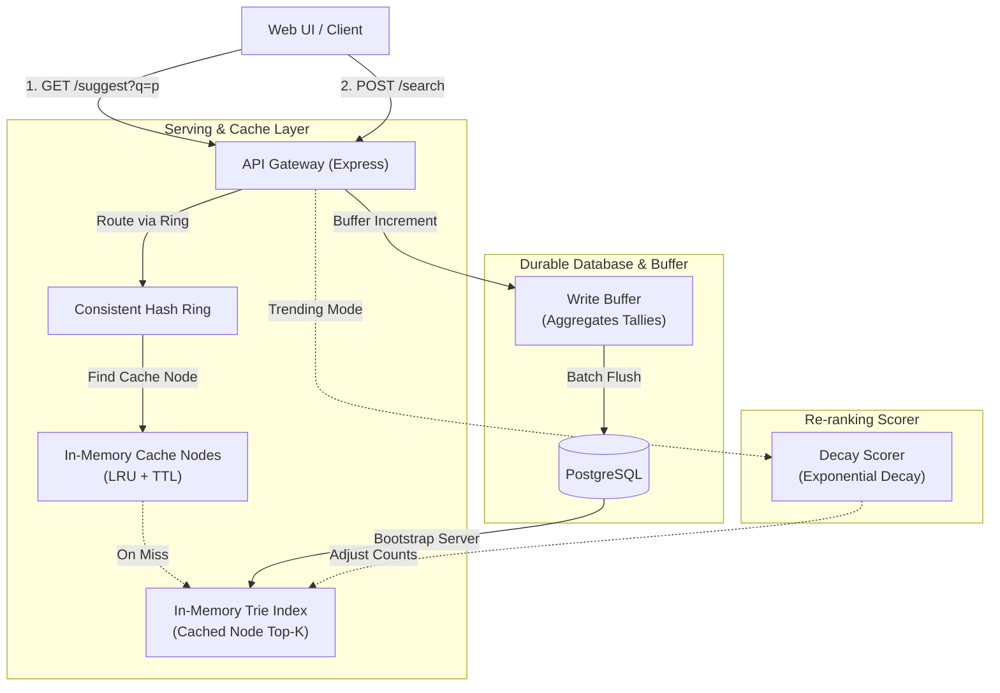

# High-Performance Node.js Typeahead Autocomplete Engine

A sub-millisecond prefix suggestion service utilizing an in-memory Trie index, distributed cache nodes routed via a consistent hashing ring, and a durable PostgreSQL storage backend.

This system is engineered for read-heavy environments (search-as-you-type autocomplete) where keystroke latency must remain under a few milliseconds. By prioritizing read latency, decoupling databases from the request flow via write buffers, and caching hot query routes, the engine achieves stellar throughput.

*Engineered by: Masih (Roll No: 10570, Batch A)*

---

## Architecture Overview

The system architecture is structured to optimize reads while mitigating write pressure on the relational store.



### Components
1. **PostgreSQL**: Serving as the persistent source of truth, storing all normalized queries and their cumulative frequencies.
2. **In-Memory Trie**: Volatile data structure bootstrapped from PostgreSQL on startup, answering prefix queries instantaneously.
3. **Consistent Hashing Cache Ring**: Simulates a distributed cache environment. It hashes incoming query prefixes to assign them to specific virtualized cache nodes containing TTL and LRU evictions.
4. **Buffered Write Queue**: Aggregates incoming queries to minimize database writing cycles (saving on locking/transactions).
5. **Decay Scorer**: Computes exponential decay scores on the fly for queries to enable recency-aware "trending" suggestions.

---

## Getting Started

### Prerequisites
- Docker & Docker Compose
- The AOL user query dataset: Download [AOL User Session Collection 500k](https://www.kaggle.com/datasets/dineshydv/aol-user-session-collection-500k) from Kaggle.

### 1. Ingestion Set Up
Unzip the Kaggle dataset, locate the query text file, and store it in a directory named `data`:
```bash
mkdir -p data
mv user-ct-test-collection-02.txt data/
```

### 2. Launch Postgres Service
Bring up the database container:
```bash
docker compose up -d postgres
```
*Note: Postgres is exposed on port `5433` of the host to prevent collisions with existing local installations.*

### 3. Load the Query Dataset
Run the ingestion worker to parse, normalize, aggregate, and upload the query logs to PostgreSQL:
```bash
docker compose run --rm ingest -file=/data/user-ct-test-collection-02.txt
```
This utility aggregates duplicate entries in memory before performing batch inserts, populating the database with approximately 1.24 million unique queries.

### 4. Run the API and Autocomplete Server
Build and launch the Express API server:
```bash
docker compose up --build server
```
On boot, the server reads the PostgreSQL tables via database cursors and constructs the memory Trie in under 22 seconds, then begins listening on port `8080`.

### 5. Access the Search Dashboard
Open **http://localhost:8080/** in your web browser. Type keywords (e.g., `goog`, `map`, `ebay`) and toggle between count-based and trending recency-aware ranking.

---

## API Specification

All data queries and transactions are served through JSON HTTP endpoints.

| Route | HTTP Verb | Purpose | Parameters |
|---|---|---|---|
| `/suggest` | `GET` | Fetch suggestion autocomplete results | `q` (string), `mode` (optional, set to `trending` for recency) |
| `/search` | `POST` | Record a search query | Body: `{"query": "string"}` |
| `/cache/debug` | `GET` | View ring node allocation details | `prefix` (string) |
| `/cache/stats` | `GET` | Read hit rates, miss counts, and size per cache node | None |
| `/stats` | `GET` | Retrieve write buffer flush status and write reductions | None |

### Test Commands
```bash
# Basic autocomplete lookup
curl -s "http://localhost:8080/suggest?q=goog"

# Recency decayed suggestions
curl -s "http://localhost:8080/suggest?q=goog&mode=trending"

# Submit a search (async buffered update)
curl -X POST http://localhost:8080/search -d '{"query":"laptop"}'

# Verify consistent hashing node ownership
curl -s "http://localhost:8080/cache/debug?prefix=goog"
```

---

## Directory Structure

```
.
├── src/
│   ├── server.js     # Bootstrapping, database initialization, and listener
│   ├── api.js        # Express HTTP router and controller logic
│   ├── store.js      # PostgreSQL cursor-based data client
│   ├── trie.js       # Memory Trie index with topK optimizations
│   ├── cache.js      # Consistent Hashing ring and logical LRU nodes
│   ├── buffer.js     # Write buffer aggregator and database flusher
│   └── trending.js   # Time decay query scorer
├── web/
│   └── index.html    # Premium dark theme dashboard interface
├── scripts/
│   └── benchmark.sh  # Client-side latency benchmarking utility
├── Dockerfile        # Multi-stage Docker builder script
└── docker-compose.yml# Container orchestration manifest
```