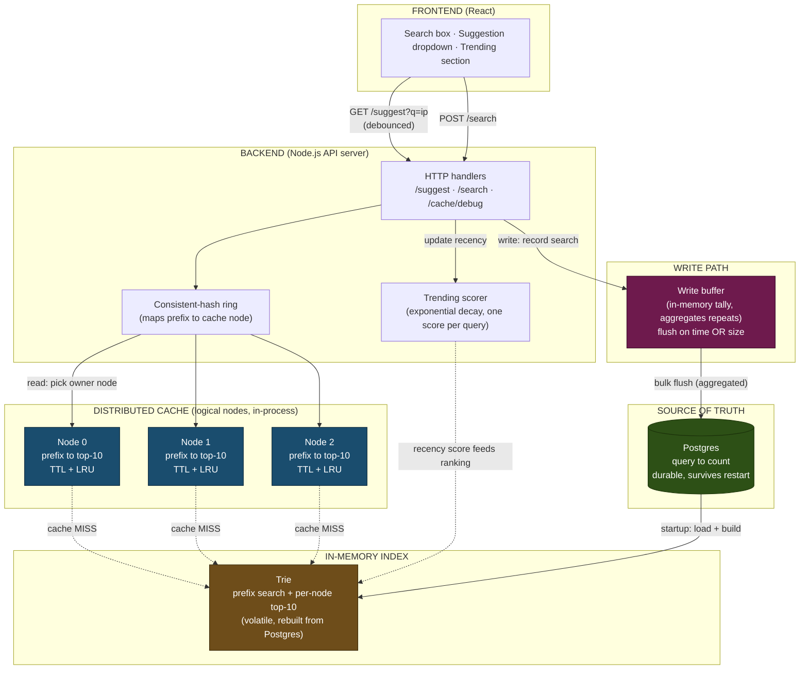

# Search Typeahead System

A search-as-you-type service. As you type, it suggests popular queries that
start with your prefix, ranked by popularity. Submitting a search records it and
updates popularity. Suggestions are served from a distributed in-process cache
in front of an in-memory trie, backed by Postgres as the durable source of
truth. Recent searches can be boosted via a recency-aware (trending) ranking,
and search-count writes are batched to keep write pressure off the database.

Built in Node.js. The frontend is a single static HTML page served by the same
server.

**Update by name: Masih, rollno: 10570, batchA**

## What it does

- Prefix suggestions, top 10 by count, case-insensitive, handles empty input
- Search submission with a stub response, recorded into popularity counts
- Distributed cache across logical nodes, routed by consistent hashing
- Trending mode: recency-aware ranking via exponential time decay
- Batched writes: search submissions are aggregated and flushed in bulk
- A live web UI that surfaces cache hit/miss, owning node, and latency per request

## Architecture



Four storage layers, each with a distinct job:

- **Postgres** is the durable source of truth (`query, count`). It survives
  restarts and receives batched writes.
- **Trie** is an in-memory prefix index built from Postgres at startup. It
  answers prefix queries fast and caches a top-10 list at each node. It is
  volatile and rebuilt from Postgres on restart.
- **Distributed cache** holds finished suggestion lists for hot prefixes,
  spread across logical nodes and routed by a consistent-hash ring.
- **Write buffer** tallies search submissions in memory and flushes them to
  Postgres in batches.

The full reasoning is in [DESIGN.md](DESIGN.md).Performance numbers are in
[PERFORMANCE.md](PERFORMANCE.md).

The whole design follows from one fact: reads (suggestions, on every keystroke)
vastly outnumber writes (submissions). Everything is shaped to make reads nearly
free and to defer and batch the write cost.

## Setup

Everything runs in Docker — Postgres, ingestion, and the server. You do not need
Node.js installed to run it; the source code is copied into the image.

Requirements: Docker (with Compose) and the AOL query dataset.

### 1. Get the dataset

This project uses the AOL query log, available on Kaggle:
[AOL User Session Collection 500k](https://www.kaggle.com/datasets/dineshydv/aol-user-session-collection-500k?resource=download).
Download it and unzip it. You will get tab-separated files named
`user-ct-test-collection-NN.txt`.

Create a `data/` folder and put the file in it:

```
mkdir -p data
mv user-ct-test-collection-02.txt data/
```

The `data/` folder is mounted into the ingest container, so the container sees
the file at `/data/user-ct-test-collection-02.txt`.

The dataset is **not** committed to this repo: it is large and, given the AOL
log's history, not ours to redistribute. Only the query text is used; all
user-identifying columns (user ID, timestamps, clicked URLs) are discarded
during ingestion.

### 2. Start Postgres

```
docker compose up -d postgres
```

Postgres runs on host port **5433** (not the default 5432) to avoid colliding
with any local Postgres install. A healthcheck makes the ingest and server
containers wait until it is genuinely ready before they connect.

### 3. Ingest the data

```
docker compose run --rm ingest -file=/data/user-ct-test-collection-02.txt
```

`ingest` is a one-time job (it does **not** start on a normal `up` — it sits
behind a Compose profile). Note the path is the container's view of the mounted
folder, `/data/...`, not the host path. It reads the file, normalizes queries
(lowercase, trim, drop empty/`-` placeholders), aggregates counts in memory, and
bulk-loads `query, count` into Postgres. One file yields ~1.24M unique queries.

Counting note: every appearance of a query in the log counts toward its
popularity (a query with multiple clicked-result rows counts each row). This is
used as a popularity proxy rather than a strict search-event count. See
DESIGN.md for why.

### 4. Run the server

```
docker compose up --build server
```

This builds the server image and runs it. It loads Postgres into the trie at
startup (~8s for 1.24M queries), then serves on **:8080**.

### 5. Open the UI

Visit **http://localhost:8080/** in a browser. Type a prefix (try `goog`, `map`,
`ebay`), use arrow keys to navigate, Enter or the Search button to submit. The
panel shows what each request did: latency, cache hit/miss, owning node, and the
write-buffer stats.

To stop everything: `docker compose down` (add `-v` to also wipe the Postgres
volume for a fully clean slate).

> The connection string is configurable via the `DATABASE_URL` environment
> variable (set automatically in `docker-compose.yml`). It falls back to
> `localhost:5433` when unset, so `npm start` and
> `npm run ingest` still work against the Compose Postgres if you prefer a
> local Node.js toolchain.

## API

| Method | Path | Purpose | Notes |
|---|---|---|---|
| GET | `/suggest?q=<prefix>` | Top 10 prefix matches by count | Add `&mode=trending` for recency-aware ranking |
| POST | `/search` | Record a search, return stub | Body: `{"query":"..."}`, returns `{"message":"Searched"}` |
| GET | `/cache/debug?prefix=<p>` | Which node owns a prefix, hit/miss | For demonstrating consistent hashing |
| GET | `/cache/stats` | Per-node cache hits/misses/size | |
| GET | `/stats` | Write-buffer stats | searches received, flushes, rows written |

### Examples

```
# basic suggestions
curl "http://localhost:8080/suggest?q=goog"

# trending (recency-aware) suggestions
curl "http://localhost:8080/suggest?q=goog&mode=trending"

# submit a search
curl -X POST http://localhost:8080/search -d '{"query":"iphone"}'

# which node owns this prefix, and is it cached?
curl "http://localhost:8080/cache/debug?prefix=goog"
```

## Demonstrations

These optional utilities run on the host and need a local Node.js environment.
They talk to the Compose Postgres over the exposed `localhost:5433` port.

### Performance

```
./scripts/benchmark.sh
```

Measures p95 latency (cache path vs trie path), cache hit rate, and write
reduction through batching. Requires `hey` (`brew install hey`). Results and
their interpretation are in PERFORMANCE.md.

### Trending rise-and-fall

In the UI, switch to trending mode and watch a low-ranked query climb after a
burst of searches, then fall back as its recency score decays. The decay
half-life is configurable in `src/server.js` (set short for live demos).

## Layout

```
src/
  server.js    server entrypoint: wiring and lifecycle
  ingest.js    one-time AOL loader
  store.js     Postgres source of truth
  trie.js      in-memory prefix index with per-node top-K
  cache.js     distributed cache: ring (consistent hashing) + nodes
  buffer.js    write buffer (batching)
  trending.js  recency scorer (exponential decay)
  api.js       Express routing
web/
  index.html   frontend
scripts/
  benchmark.sh performance measurement
```

## Notes and trade-offs

- The cache nodes are logical abstractions in one process, simulating
  distribution. In production they would be separate processes or Redis
  instances; the consistent-hash routing is identical either way.
- Batching means a hard crash loses buffered-but-unflushed searches. Acceptable
  for ranking data; clean shutdown flushes to shrink the window.
- The trie's top-K is computed once at startup. Live count changes go to
  Postgres via the buffer; the trie can be rebuilt periodically or accept slight
  staleness, which is fine for ranking.
- See DESIGN.md for the full reasoning behind each choice.